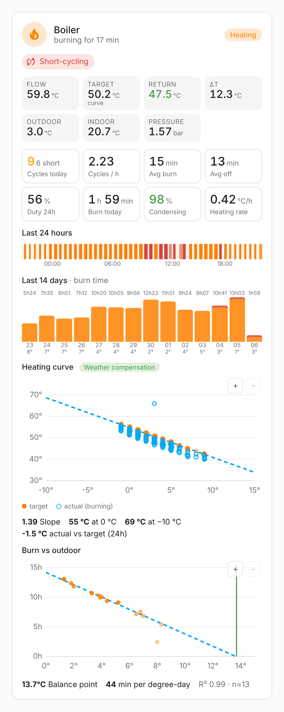
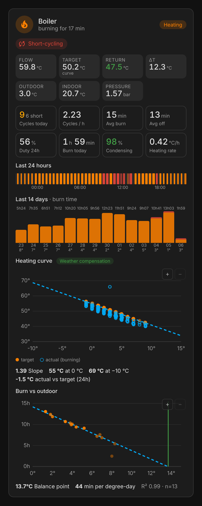
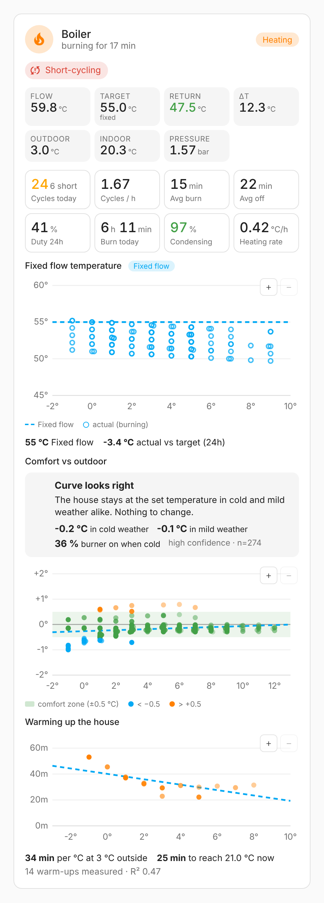
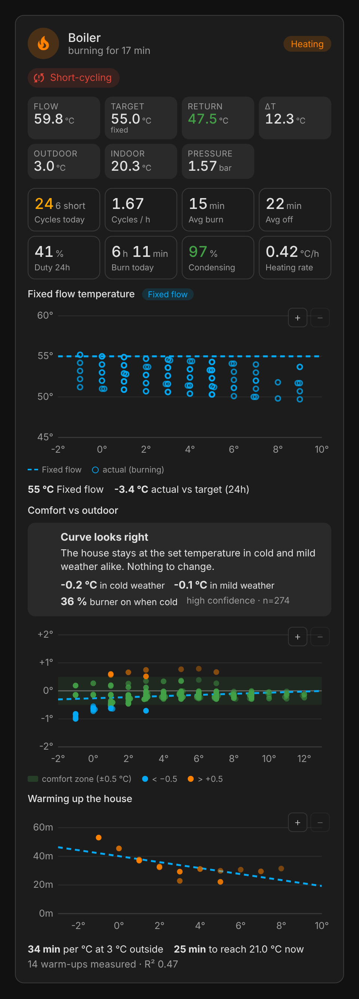
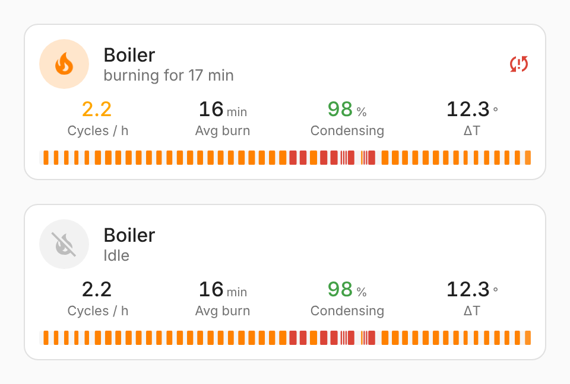
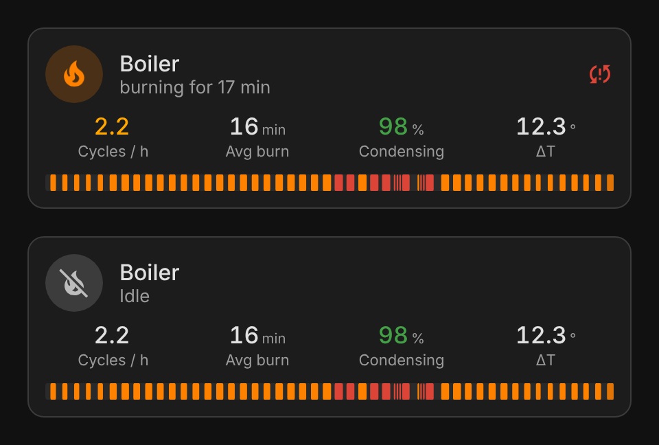
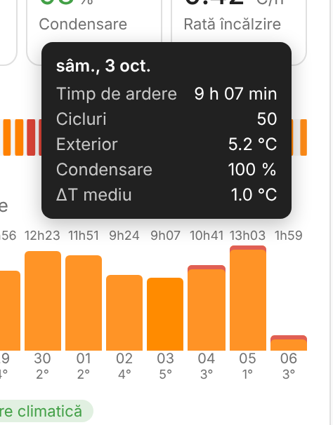
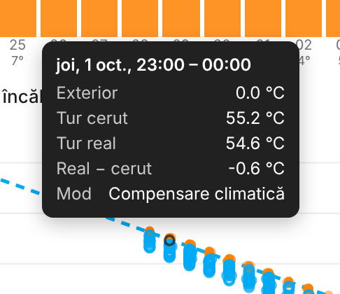

# Boiler Monitoring for Home Assistant

[](https://hacs.xyz/docs/faq/custom_repositories)
[](https://github.com/sandreialexandru/Boiler-Monitoring-for-Home-Assistant/actions/workflows/validate.yml)


A Home Assistant integration that monitors your gas boiler in depth: burner cycles, short-cycling, condensing efficiency (return temperature), flow/return ΔT, the actual effect on room temperature, and how burn time correlates with outdoor temperature. Use it to tune your weather-compensation curve. It ships with its own Lovelace card in **full** and **compact** modes, which loads automatically.

It works with any boiler. All it needs is an entity that tells it when the burner is firing (or when there is heat demand): a relay, a flame sensor, a `climate` entity or a text sensor. Every other sensor is optional.

<p align="center">
  
  &nbsp;
  
</p>

<p align="center">
  
  &nbsp;
  
</p>

<p align="center">
  
  &nbsp;
  
</p>

---

## Contents

- [Features](#features)
- [Installation](#installation)
- [Configuration](#configuration)
- [Entities](#entities)
- [The card](#the-card)
- [Reading the card: a plain-language guide](#reading-the-card-a-plain-language-guide)
- [Events, services and CSV log](#events-services-and-csv-log)
- [How the numbers are calculated](#how-the-numbers-are-calculated)
- [Using it to tune your heating curve](#using-it-to-tune-your-heating-curve)
- [Example: ESPHome relay + DS18B20](#example-esphome-relay--ds18b20)
- [FAQ / troubleshooting](#faq--troubleshooting)
- [Development](#development)

## Features

| | |
|---|---|
| 🔥 **Cycle statistics** | cycles today, cycles per hour, average burn and off times, duty cycle, burn time today, last burn |
| 🔁 **Short-cycling detection** | flags any restart sooner than *N* minutes after the previous stop. The off-time is measured from the stored stop time, so a Home Assistant restart never produces a false alarm |
| 💧 **Condensing efficiency** | % of burn time with the return below the condensing threshold, plus an alert when the return stays too hot |
| 🌡️ **Flow/return ΔT** | live, and as a daily average |
| 🎯 **Flow target vs actual** | compares the real flow temperature with the boiler's setpoint and knows whether the boiler runs on **weather compensation** (automatic thermoregulation) or a **fixed flow temperature**. The card draws the real heating curve, or the fixed flow line |
| 🧯 **Pressure** | heating-circuit pressure with low/high alert (all year) and a 7-day trend to spot slow leaks |
| 🏠 **Heating effect** | measures how much the rooms actually warmed after the burner started (°C/h) and alerts when the boiler burns without effect |
| 📈 **Outdoor correlation** | daily burn hours vs outdoor temperature, linear regression, **balance point**, **burn hours per degree-day** |
| ❄️ **Season gating** | optionally pauses all monitoring outside the heating season, so domestic-hot-water starts in summer don't count |
| 🔔 **Alerts** | problem binary sensors, HA events, optional push notifications (tagged, max 1/hour per type) |
| 🗒️ **CSV log** | every START / STOP / SHORT_CYCLE / RETURN_HOT / INEFFECTIVE event, ready for Excel |
| 🧩 **UI-only setup** | config flow, options flow, reconfigure. No YAML, no helpers, no File integration |
| 🌍 **Translations** | English, Romanian |

## Installation

### HACS (recommended)

1. HACS → **Integrations** → ⋮ → **Custom repositories**
2. Add `https://github.com/sandreialexandru/Boiler-Monitoring-for-Home-Assistant`, category **Integration**
3. Install **Boiler Monitor** and restart Home Assistant

### Manual

Copy `custom_components/boiler_monitor` into `/config/custom_components/` and restart Home Assistant.

### Add the integration

**Settings → Devices & services → Add integration → Boiler Monitor**

The card is registered automatically, so you don't need to add a dashboard resource. If it doesn't show up in the card picker right away, hard-refresh the browser (Ctrl+F5).

## Configuration

### Step 1: entities (set at creation, change later via ⋮ → **Reconfigure**)

| Field | Required | Description |
|---|---|---|
| Name | ✅ | Used for entity IDs (`sensor.<name>_status`…) |
| Burner / heat-demand entity | ✅ | `switch`, `binary_sensor`, `input_boolean`, `climate` or `sensor` |
| State meaning "burner on" | ✅ | `on` for switches and binary sensors. For a **climate** entity, the `hvac_action` value (`heating`). For a text sensor, the exact state string |
| Flow temperature sensor | – | Enables ΔT |
| Return temperature sensor | – | Enables condensing ratio and the condensation-lost alert |
| Outdoor temperature sensor | – | Enables balance point and burn per degree-day |
| Indoor temperature sensors | – | One or more; their average is used for the heating-effect check |
| Flow target / setpoint sensor | – | The flow temperature the boiler aims for (e.g. Ariston *CH flow setpoint temp*). Enables flow-vs-target and the heating-curve chart |
| Automatic thermoregulation entity | – | Switch that turns weather compensation on/off (e.g. Ariston *automatic thermoregulation*). ON = curve, OFF = fixed flow. The card adapts to it |
| Heating circuit pressure sensor | – | In bar (e.g. Ariston *heating circuit pressure*). Enables the pressure alert and the 7-day trend |
| Heating-season entity / state | – | e.g. `input_boolean.heating_season` = `on`, `climate.x` = `heat`, or an `input_select` option. Leave it empty to monitor all year |

Entities that need a sensor you didn't configure are simply not created.

> **Which burner entity should I pick?**
> If the boiler is switched by a relay from a thermostat (e.g. Generic Thermostat + ESPHome relay), the relay shows *heat demand*, not the flame. Short-cycling then means the **thermostat** is cycling, and you fix it with hysteresis or `min_cycle_duration`. If your boiler integration exposes the real flame state, use that to see the boiler's own cycling. You can add the integration **twice** (once per source) and compare them side by side.

### Step 2: tuning (⋮ → **Configure**)

| Option | Default | Meaning |
|---|---|---|
| Short-cycle threshold | 10 min | A restart sooner than this after a stop counts as a short cycle |
| Return temperature threshold | 53 °C | Above this, a condensing boiler stops condensing (≈ 55 °C dew point for natural gas; 53 °C leaves a margin) |
| Minutes above threshold before alert | 15 min | How long the return must stay hot (while burning) before *Condensation lost* triggers |
| Heating-effect check delay | 45 min | How long after a start to measure the room temperature rise |
| Minimum expected room rise | 0.2 °C | Below this, *Heating ineffective* triggers |
| Ignore burns shorter than | 20 s | Relay chatter / ignition glitches are discarded entirely |
| Notification service | – | `notify.mobile_app_your_phone` **or** a notify entity. Leave empty for no push |
| Write CSV log | on | `/config/boiler_monitor/<name>.csv` |
| Minimum / maximum pressure | 1.0 / 2.5 bar | Outside this range *Pressure problem* triggers (clears with 0.05 bar hysteresis) |

## Entities

All entities belong to one device named after your integration. The examples use the name **Centrala**.

### Sensors

| Entity | Unit | Description |
|---|---|---|
| `sensor.centrala_status` | – | `heating` / `idle` / `off_season` / `unavailable`. Its attributes carry everything the card needs |
| `sensor.centrala_cycles_today` | cycles | Burner starts since local midnight |
| `sensor.centrala_short_cycles_today` | cycles | Of which short cycles |
| `sensor.centrala_cycles_per_hour_24h` | cycles/h | Rolling 24 h |
| `sensor.centrala_average_burn_time_24h` | min | Mean burn duration, rolling 24 h |
| `sensor.centrala_average_off_time_24h` | min | Mean pause before each start, rolling 24 h |
| `sensor.centrala_last_burn_duration` | min | |
| `sensor.centrala_duty_cycle_24h` | % | Share of the last 24 h with the burner on |
| `sensor.centrala_burn_time_today` | h | `total_increasing`, so it works with long-term statistics and the statistics-graph card |
| `sensor.centrala_condensing_ratio_24h` | % | Share of burn time with return < threshold *(needs return)* |
| `sensor.centrala_flow_return_dt` | °C | Live flow − return *(needs flow + return)* |
| `sensor.centrala_heating_rate` | °C/h | Room warming rate from the last effect check *(needs indoor)* |
| `sensor.centrala_balance_point` | °C | Outdoor temperature at which the house needs no heating *(needs outdoor, ≥ 3 full days)* |
| `sensor.centrala_burn_hours_per_degree_day_7d` | h/°C·day | Burn hours ÷ heating degree-days over the last 7 full days *(needs outdoor)* |
| `sensor.centrala_regulation_mode` | – | `weather_compensation` / `fixed` *(needs thermoregulation entity)* |
| `sensor.centrala_flow_vs_target_24h` | °C | Average of actual flow − target while burning, last 24 h. The first 5 minutes of each burn (warm-up) are ignored *(needs flow + setpoint)* |
| `sensor.centrala_heating_curve_slope` | °C/°C | How many °C the flow target rises for each °C colder outside, fitted from the last 7 days in weather-compensation mode *(needs setpoint + outdoor)* |
| `sensor.centrala_pressure_change_7d` | bar | Pressure now vs the oldest day of the last week. A steady negative value means a slow leak *(needs pressure)* |

### Binary sensors

| Entity | Device class | On when |
|---|---|---|
| `binary_sensor.centrala_burner` | heat | Burner on (and in season) |
| `binary_sensor.centrala_short_cycling` | problem | A short cycle happened in the last 60 minutes |
| `binary_sensor.centrala_condensation_lost` | problem | Return above threshold for *N* minutes while burning. Clears when the return drops 1 °C below the threshold or the burner stops |
| `binary_sensor.centrala_heating_ineffective` | problem | The last effect check measured less than the minimum rise |
| `binary_sensor.centrala_pressure_problem` | problem | Pressure below the minimum or above the maximum |

## The card

### Full card: all options

```yaml
type: custom:boiler-monitor-card
entity: sensor.centrala_status   # the Status sensor of the integration (required)
title: Centrala                  # optional, defaults to the device name
mode: full                       # full | compact
show_timeline: true              # 24 h burner timeline (short cycles in red)
show_daily: true                 # last 14 days: burn hours per day + outdoor avg
show_correlation: true           # burn vs outdoor scatter + regression + balance point
show_curve: true                 # heating curve (weather compensation) or fixed-flow chart
```

### Compact card

```yaml
type: custom:boiler-monitor-card
entity: sensor.centrala_status
mode: compact
```

The compact card shows the status, active alerts as icons, four key numbers and a slim 24 h timeline. It fits a wall tablet or a sidebar.

### What's on the full card

1. **Header**: animated flame while burning, how long the current burn has lasted, a status chip.
2. **Alert chips**: short-cycling, condensation lost, heating ineffective, pressure problem. They only appear when active.
3. **Live values**: flow, target (with the mode, *curve* or *fixed*), return (green while condensing, red above the threshold), ΔT, outdoor, indoor average, pressure.
4. **Statistics tiles**: cycles today (with short cycles), cycles/h, average burn, average off, 24 h duty cycle, burn today, condensing %, heating rate.
5. **Last 24 hours**: every burn as a bar.
6. **Last 14 days**: burn time per day.
7. **Heating curve / Fixed flow temperature**, if you configured a setpoint sensor.
8. **Burn vs outdoor**: one dot per full day.

Durations are always in hours and minutes (`2 h 14 min`, `45 min`), never decimal hours. Tapping a value opens the more-info dialog of the underlying entity. The card follows your theme (light/dark), works in masonry and sections views, and has a visual editor.

### Tooltips

Hover any bar, dot or timeline segment with the mouse, or **tap** it on a phone or tablet, to see its details. Tap again, or tap anywhere else on the card, to close it.

| Where | What the tooltip shows |
|---|---|
| Last 24 hours (a segment) | start – end time, burn duration, whether it was a short cycle |
| Last 14 days (a bar) / Burn vs outdoor (a dot) | the day, burn time, cycles (and how many were short), average outdoor temperature, condensing %, average ΔT |
| Heating curve (a dot) | the day and hour, outdoor temperature, target flow, actual flow, actual − target, regulation mode |

<p align="center">
  
  &nbsp;
  
</p>

A complete example dashboard view is in [`examples/dashboard.yaml`](examples/dashboard.yaml).

## Reading the card: a plain-language guide

The ranges below are rules of thumb for a gas condensing boiler with radiators. Every house is different. What matters most is how **your own** numbers change over time.

### Live values

| Value | What it is | Good | Watch out |
|---|---|---|---|
| **Flow** | water leaving the boiler towards the radiators | 35–55 °C, lower when it's milder outside | above 65 °C when it's only a few degrees below zero |
| **Target** | the flow temperature the boiler is aiming for. *curve* = it follows the outdoor temperature, *fixed* = a constant value you set | – | – |
| **Return** | water coming back from the radiators | **below the threshold** (green) | **red**: the boiler has stopped condensing |
| **ΔT** | flow − return: how much heat the radiators gave off | 10–20 °C | below 8 °C: pump too fast or water bypassing the radiators |
| **Pressure** | water pressure in the heating circuit. The arrow (↓0.2) appears when it moved ≥ 0.1 bar in a week | 1.0–2.0 bar | red: outside the min/max you set. A steady ↓ week after week means a slow leak |

### Statistics tiles

| Tile | Meaning | Good | Problem |
|---|---|---|---|
| **Cycles today** | burner starts since midnight, with the short ones | few starts, 0 short | many short cycles |
| **Cycles / h** | starts per hour, averaged over 24 h | ≤ 2–3 | > 4 (turns amber) |
| **Avg burn** | how long the burner runs each time | ≥ 10–15 min | < 5–7 min |
| **Avg off** | pause between burns | ≥ 10 min | a few minutes |
| **Duty 24h** | share of the last 24 h with the burner on | depends on the weather: 20–40 % in mild weather, 60–90 % in frost | 100 % for days in a row in frost: the boiler barely keeps up |
| **Burn today** | total burn time since midnight | – | compare with days of similar weather |
| **Condensing** | share of burn time with the return at or below the threshold | **≥ 80 %** (green) | < 50 % (red): efficiency lost |
| **Heating rate** | how fast the rooms warmed after the burner started | 0.3–1 °C/h | ≤ 0: burning without effect |

### Last 24 hours

Every orange segment is one burn. Its width is how long it lasted, and the gap before it is the pause.
- **Long, well-spaced segments** are what you want.
- **Many thin segments packed together** mean the boiler is switching on and off all the time.
- **Red** = short cycle (it restarted too soon after the previous stop). Note **when** they happen: often in the morning after a night set-back, or at midday when the sun comes out.
- The segment that **pulses** is the burn happening right now.

### Last 14 days

One bar per day. Above the bar is the total burn time. Below it are **the day of the month** and **the average outdoor temperature** that day. The last bar is today, so it is still growing.
- Bars should be **taller on colder days**.
- A tall bar on a mild day is suspicious: a window left open, a curve set too high, guests…
- A **red cap** on top means there were short cycles that day.

### Heating curve (weather compensation)

When automatic thermoregulation is **on**, the boiler looks at the outdoor temperature and decides how hot the water should be. The colder it is, the hotter the water. That rule is the **heating curve**.

- **Orange dots**: one per hour = the target the boiler chose at that outdoor temperature.
- **Hollow blue circles**: the real flow during the same hour while burning (the first 5 minutes of each burn, while the water heats up, are left out).
- **Dashed line**: the straight line that fits the orange dots best.
- **Slope**: how many °C the target rises for each °C colder outside.
- **At 0 °C / at −10 °C**: the target read off the line.

**How the slope is calculated.** Every hour gives one point: (average outdoor temperature, average target). Over a few days you get dozens of points at different outdoor temperatures. The integration lays a straight ruler through them so that it passes as close as possible to all of them (a *least-squares* fit), and the slope is how steep that ruler is. Example, slope = 1.4:

| Outdoor | Target |
|---|---|
| 10 °C | 41 °C |
| 0 °C | 55 °C |
| −10 °C | 69 °C |

From 0 °C to −10 °C is 10 degrees colder, so the target rises by 10 × 1.4 = 14 °C. The slope needs at least **6 hours spanning ≥ 3 °C** of outdoor temperature. If all the points sit at the same outdoor temperature, the ruler could point anywhere.

> The slope here is in °C of flow per °C outdoor. The number you set in the boiler's menu is on the manufacturer's own scale and **will usually not be the same number**. What matters is how our slope moves when you change the setting.
>
> The boiler computes its curve from **its own** outdoor value. If you want this chart to match the boiler exactly, use the boiler's outdoor sensor (e.g. Ariston *Outside temp*) as the integration's outdoor sensor, or check that both read the same.

**Reading it:**

| You see | It means |
|---|---|
| Orange dots sit neatly on the line | the boiler follows its curve. Normal |
| Blue circles **on or slightly below** the orange dots | the boiler reaches its target. Ideal |
| Blue **well below** orange (5 °C or more), all the time | it can't reach the target: power limited, pump too fast, or it stops before getting there |
| Blue **above** orange, plus many short cycles | even at minimum power the boiler gives more heat than needed: it overshoots, stops, restarts |
| Orange dots scattered, not on a line | the target also changed for other reasons (settings changed, mode switched), or the outdoor sensor isn't the one the boiler uses |

*Actual vs target (24h)* under the chart is the average gap between blue and orange. Between −3 and +1 °C is good.

### Fixed flow temperature

When thermoregulation is **off**, the boiler always aims for the same flow temperature.

- **Dashed line**: the fixed flow temperature you set.
- **Hollow blue circles**: the real flow while burning, at different outdoor temperatures.

The blue circles should stay close to the line. The chart also makes one thing visible: with a fixed flow, **the water is just as hot at +10 °C outside as at −10 °C**. In mild weather that is far more than the house needs, which leads to short cycles and less condensing. If you see many circles on the warm side of the chart **and** short cycling, switching thermoregulation on is likely to help.

Every change of mode is written to the CSV log (`MODE`), and so is every change of the fixed temperature (`SETPOINT`), so you can tell what changed and when.

### Burn vs outdoor

This chart answers one question: **how long must the boiler burn in a day, given how cold it was outside?**

- **Each orange dot is one full day**: average outdoor temperature (horizontal) and total burn time (vertical). Paler dots are older days. Today is not shown until it is over.
- **Dashed line**: the best straight line through the dots. It goes down to the right: the warmer it is outside, the less the boiler burns.
- **Green vertical line**: the **balance point**, where the line reaches zero burn time.

**The numbers below the chart:**

- **Balance point** (e.g. 13.7 °C): above this daily average outdoor temperature your house needs no heating. Sun, people and appliances keep it warm. For an ordinary house it is usually **14–17 °C**. Much higher (19–20 °C) means the house loses a lot of heat, or the curve is set too high and the boiler heats when it doesn't need to.
- **Minutes per degree-day** (e.g. 44): how long the boiler burns for each degree-day of cold. This is **the number to compare before and after a change**, because it is already corrected for the weather. **Lower is better.** It is calculated over the last 7 complete days.
- **R²**: how well the dots follow the line, from 0 to 1. Above 0.7 the balance point can be trusted. Below 0.5, wait a few more days.
- **n**: how many days the line is based on.

**What is a degree-day?** It measures how cold a day was: `18 °C − the day's average outdoor temperature` (0 if the result is negative).
- A day averaging 3 °C → 18 − 3 = **15 degree-days**
- A day averaging 13 °C → **5 degree-days**

With 44 min per degree-day, the 15 degree-day day needs 15 × 44 = 660 min = **11 h** of burning.

**Why 18 °C?** It is a convention, not something measured in your house. It is the base commonly used in Europe (Eurostat uses 18 °C too): at an average of 18 °C outside, a typical house needs no heating. Other standards use other bases (15.5 °C in the UK, 20 °C in some German norms). For comparing one week with another the exact base doesn't matter, as long as it stays the same. Your measured **balance point** is the base that actually fits your house.

| You see | It means |
|---|---|
| Dots close to the line | the house behaves predictably. Normal |
| One dot well **above** the line | that day used more than usual for the weather: open window, strong wind, guests, a higher room setting |
| One dot well **below** the line | less than usual: strong sun, nobody home, or an incomplete first day |
| New (solid) dots **below** the old (pale) ones | a recent change helped: less burning in the same weather |
| New dots **above** the old ones | you now burn more in the same weather. Check what changed |

> If the burner entity is a relay driven by a thermostat, "burn time" is really *heat-demand time*: the boiler may modulate or pause inside it. That is fine for comparing weeks, because it is measured the same way every day.

## Events, services and CSV log

### Events

| Event | Data |
|---|---|
| `boiler_monitor_short_cycle` | `entry_id`, `name`, `off_minutes` |
| `boiler_monitor_condensation_lost` | `entry_id`, `name`, `return` |
| `boiler_monitor_heating_ineffective` | `entry_id`, `name`, `rise` |
| `boiler_monitor_cycle_end` | `entry_id`, `name`, `burn_minutes`, `off_minutes_before`, `short_cycle`, `outdoor` |
| `boiler_monitor_regulation_changed` | `entry_id`, `name`, `mode`, `target` |
| `boiler_monitor_pressure_problem` | `entry_id`, `name`, `pressure`, `kind` (`low`/`high`) |

Ready-to-use automations (an actionable alert, a logbook entry per cycle, a daily summary) are in [`examples/automations.yaml`](examples/automations.yaml).

### Service

`boiler_monitor.reset_statistics` clears stored cycles and statistics. Pass `entry_id` to limit it to one boiler.

### CSV log

`/config/boiler_monitor/<name>.csv`, separated by `;`:

```
time;event;burn_min;off_min;outdoor;flow;return;indoor_avg;extra
2026-11-10 06:12:04;START;;24.5;1.8;58.2;44.1;20.31;
2026-11-10 06:29:40;STOP;17.6;;1.8;61.0;47.9;20.52;
2026-11-10 06:33:02;START;;3.4;1.8;55.3;46.0;20.55;
2026-11-10 06:33:02;SHORT_CYCLE;;3.4;1.8;55.3;46.0;20.55;
```

## How the numbers are calculated

- **Off-time / short cycles.** When the burner stops, the stop timestamp is stored on disk. At the next start, off-time = now − stored stop. A cycle that was already running when Home Assistant started is marked *partial* and never counts as a short cycle. *(The usual automation approach based on `last_changed` gives false short cycles after every restart.)*
- **Glitches.** Burns shorter than *Ignore burns shorter than* are removed completely: from the counters, from burn time and from off-time calculations.
- **Burn time** is accumulated per hour bucket and split exactly at hour boundaries, so daily totals are correct across midnight.
- **Condensing ratio.** Once a minute, while burning, the integration checks whether the return is at or below the threshold. Ratio = condensing minutes ÷ sampled burning minutes over the last 24 h. Each minute is judged against the threshold set at that moment, so after you change the threshold the ratio needs up to 24 h to catch up (or run `boiler_monitor.reset_statistics`). The sensor's attributes show the threshold in use, the minutes counted and the highest return seen while burning.
- **Heating effect.** At burner start it stores the average of the indoor sensors. After the delay it computes rise and rate (°C/h). If the burner cycles faster than the delay, the pending check is **kept**, not restarted, so it measures the whole heating period.
- **Regression / balance point.** For each *complete* past day (≥ 20 h of samples) it computes `burn_hours = a + b · outdoor_avg` by least squares. Balance point = −a / b, the outdoor temperature at which predicted burn time is zero. It needs at least 3 complete days.
- **Burn per degree-day** = Σ burn hours ÷ Σ max(0, 18 °C − outdoor_avg) over the last 7 complete days.
- **Flow vs target.** Every minute while burning, after the first 5 minutes of the burn: actual flow − target. In fixed mode, changes of the fixed setpoint are written to the CSV (`SETPOINT`), and every switch of the regulation mode too (`MODE`).
- **Heating curve.** The target and outdoor temperature are averaged per hour. Hours in weather-compensation mode are fitted with a straight line. It needs at least 6 hours spanning ≥ 3 °C outdoor. Use the same outdoor sensor the boiler uses (e.g. Ariston *Outside temp*) if you want the chart to match the boiler's own curve exactly.
- **Pressure** is sampled all year (also outside the heating season). The trend compares hourly averages, so heat-up swings are smoothed out.
- **Storage.** Cycles are kept for 7 days and hourly aggregates for 60 days, in `.storage/boiler_monitor.<entry_id>`. The large attributes (timeline, daily) are excluded from the recorder, so they don't bloat your database.

## Using it to tune your heating curve

**The method:**
1. Write down **minutes per degree-day** and **condensing %** as they are now.
2. Change **one** thing, in small steps: curve slope ±0.1–0.2, offset ±1–2 °C, thermostat hysteresis, or pump speed.
3. Wait **5–7 days**, ideally with similar weather.
4. Compare. If minutes per degree-day went down and the rooms are still comfortable, keep the change.

**Which knob to turn**, based on room comfort:

| Symptom | Change |
|---|---|
| **Cold indoors when it's freezing**, fine when mild | **raise the slope** |
| **Too warm indoors when it's mild**, fine when freezing | **lower the offset** (shifts the whole line down) |
| **Always too cold**, whatever the weather | **raise the offset** |
| **Always too warm** | **lower the offset** |

**What the card tells you to fix:**

| What you see | Likely cause | What to try |
|---|---|---|
| Many short cycles, short burns (< 10 min) | Boiler minimum output > heat demand; curve too high in mild weather | Lower the curve **offset**; enable or extend the boiler's anti-cycling timer; with a thermostat relay, increase hysteresis or `min_cycle_duration` |
| Condensing ratio < 80 %, *Condensation lost* alerts | Flow temperature too high, or ΔT too small (pump too fast) | Lower the curve **slope**; reduce the pump speed so ΔT reaches ~15–20 °C |
| ΔT < 8 °C | Pump speed too high / bypass open | Lower the pump speed, check the bypass valve |
| *Heating ineffective* | Flow too low for the current outdoor temperature, TRVs closed, air in radiators | Raise the slope slightly, check TRVs, bleed radiators |
| Balance point well above 16 °C | Curve too high overall or high heat loss | Lower the offset. Check windows (or where the boiler is installed, e.g. an open balcony) |
| Real flow constantly 5 °C+ below target | Boiler can't reach the target (power limited, flow too high) | Check the pump speed and the max heating power setting |
| Real flow above target, many short cycles | Minimum modulation is higher than the demand | Lower the curve, or switch to weather compensation if you run a fixed flow |
| Fixed flow + short cycles in mild weather | Water much hotter than needed when it's mild | Switch automatic thermoregulation on |
| Pressure drops ~0.1 bar or more per week | Slow leak or a failing expansion vessel | Check radiator valves and fittings; have the expansion vessel checked |

## Example: ESPHome relay + DS18B20

A typical DIY setup: a Wemos D1 mini driving the boiler's thermostat contact through a relay, with DS18B20 probes clamped on the flow and return pipes.

```yaml
# ESPHome
one_wire:
  - platform: gpio
    pin: D4

sensor:
  - platform: dallas_temp
    address: 0x1234567890abcdef   # flow pipe
    name: "Boiler flow"
    update_interval: 30s
  - platform: dallas_temp
    address: 0xfedcba0987654321   # return pipe
    name: "Boiler return"
    update_interval: 30s

switch:
  - platform: gpio
    pin: D1
    name: "Boiler relay"
    id: boiler_relay
```

Then configure Boiler Monitor with `switch.boiler_relay` (state `on`), `sensor.boiler_flow` and `sensor.boiler_return`.
Tip: insulate the probe and the pipe together. A bare probe reads several degrees low.

## FAQ / troubleshooting

**The card says "Pick the Boiler Monitor status sensor".** Select the `sensor.<name>_status` entity, not one of the statistics sensors.

**The card isn't in the card picker.** Hard-refresh the browser (Ctrl+F5). In the companion app: Settings → Companion app → Debugging → Reset frontend cache.

**Balance point / per-degree-day stay `unknown`.** They need an outdoor sensor and at least 3 complete days (7 for per-degree-day) of data.

**My boiler also heats domestic hot water.** With a flame sensor, DHW draws look like short cycles. Use the heating-season entity, or point the integration at the heating relay / heat demand instead of the flame.

**Notifications don't arrive.** Check the logs for `notification via … failed`. The field takes either a service (`notify.mobile_app_x`) or an existing notify entity. Push alerts are limited to one per hour per alert type; events and binary sensors are never throttled.

**Where's the data stored?** In `.storage/boiler_monitor.<entry_id>` and, if enabled, in `/config/boiler_monitor/<name>.csv`.

## Development

```bash
python -m venv venv && . venv/bin/activate
pip install -r requirements_test.txt
pytest -q
```

The tests run the integration inside a real Home Assistant core with a simulated boiler. They cover cycles, short cycles, relay glitches, restarts (no false short cycles), condensation, the heating effect, season gating, `climate` entities, the outdoor regression, the CSV log and the reset service.

The card is plain JavaScript (no build step) in `custom_components/boiler_monitor/frontend/boiler-monitor-card.js`.

## License

MIT
